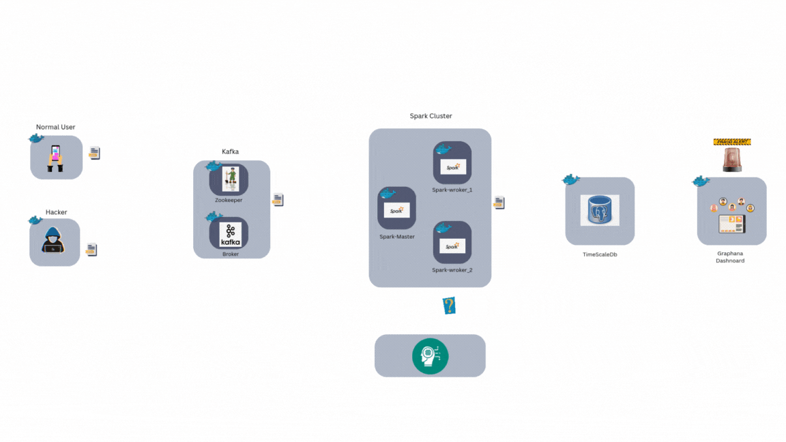
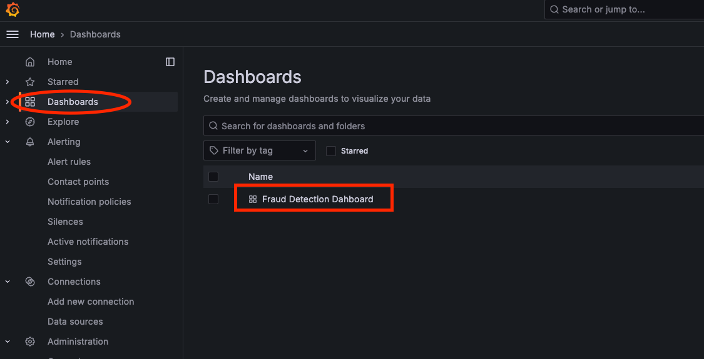
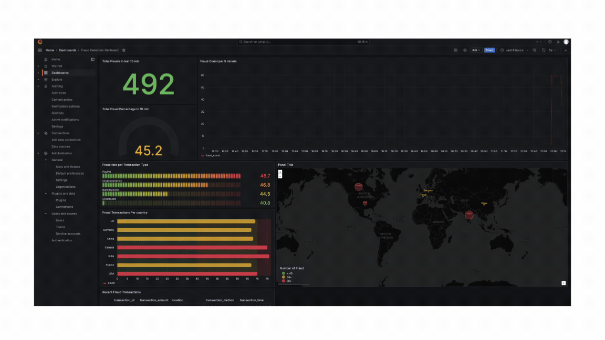

# Real-Time Fraud Detection System

## Overview

This project implements a real-time fraud detection system using Kafka, Spark Structured Streaming, Machine Learning, TimescaleDB, and Grafana for banking transactions. The system detects fraudulent transactions by processing real-time transaction data from Kafka, applying a machine learning model, and storing the results in TimescaleDB for monitoring through a Grafana dashboard.

---

## Components

The system consists of the following components:

1. **Kafka Broker**: Ingests real-time banking transactions and distributes them to consumers.
2. **Zookeeper**: Manages the Kafka broker.
3. **Producer**: 
   - **Normal Producer**: Generates legitimate transaction data and sends it to the Kafka topic `raw_transactions`.
   - **Hacker Producer**: Simulates fraudulent transactions that will be flagged by the machine learning model.
4. **Spark Cluster**: 
   - **Spark Master** and **Spark Workers**: Run a Spark Structured Streaming job that reads transaction data from Kafka, applies feature extraction, and infers fraud probability using a pre-trained machine learning model.
5. **TimescaleDB**: A PostgreSQL-based time-series database for storing the processed transaction data, including fraud predictions.
6. **Grafana Dashboard**: Visualizes the transaction data and fraud metrics in real-time.
7. **Model Build**: Contains the code and data to retrain the machine learning model.

---

## System Architecture Diagram



---

## Prerequisites

Before running the project, ensure that you have the following installed:

- Docker
- Docker Compose
- Python 3.x for model retraining (optional)

---

## Setup and Usage

### 1. Clone the Repository
```bash
git clone https://github.com/iitravindra/streaming_fraud_detection.git
cd streaming_fraud_detection
```

### 2. Build and Run the Docker Containers
Use Docker Compose to build and start the containers.

```bash
docker-compose up --build -d
```

This command starts all the services defined in the `docker-compose.yml`, including Kafka, Spark, TimescaleDB, and Grafana.

### 3. Producers
There are two producers for generating transaction data:
- **Normal Producer**: Generates regular transaction data every second.
- **Hacker Producer**: Generates fraudulent transactions intermittently to simulate real-world fraud attempts.

Both producers send the transaction data to the Kafka topic `raw_transactions`.

### 4. Spark Structured Streaming
The Spark job processes incoming transactions from Kafka, creates features, and runs inference using a pre-trained machine learning model. The results (fraud predictions) are written to TimescaleDB for further analysis.

### 5. Database (TimescaleDB)
TimescaleDB stores the processed transaction data with fraud predictions. A database schema is initialized using the SQL file located at `./monitoring/init.sql`.

### 6. Grafana Dashboard
Grafana is used to visualize real-time fraud metrics. Once the system is running, you can access the Grafana dashboard at:
```
http://localhost:3000
```
Login credentials (default):
- Username: `admin`
- Password: `admin`

Navigate to Dashboards and click on 'Fraud Detection Dahboard' dashboard.



Here, you'll be able to monitor transaction statistics and detect fraud trends over a 10-minute period.

Note - You may need to refresh the dashboard for the first time. Just refresh the dashboard page for the first time and later it will update after every 5 seconds.

## Graphana Dashboard



---

## Model Training and Retraining

If you want to retrain the fraud detection model, follow these steps:

1. **Train the Model**:
   The `model_build` directory contains the code to generate synthetic transaction data and train a machine learning model. You can use the provided `ml_model.py` script to train a new model using synthetic data.

   ```bash
   cd model_build
   python ml_model.py
   ```

   This will generate a new model binary file `fraud_detection_model.pkl`.

2. **Update the Model**:
   After training, move the new model binary from the `model_build` directory to the `data_processor` directory to replace the existing model used by the Spark Structured Streaming job.

   ```bash
   mv model_build/fraud_detection_model.pkl data_processor/fraud_detection_model.pkl
   ```

3. **Restart the Spark Job**:
   After updating the model, restart the Spark Structured Streaming job to load the updated model.

   ```bash
   docker-compose restart spark-worker
   ```

This process allows the system to use a new machine learning model for fraud detection.

---

## Directory Structure

```bash
fraud-detection-system/
├── data_producer/               # Kafka producers (normal and hacker producers)
│   ├── Dockerfile
│   ├── hacker_transaction_producer.py
│   ├── normal_transaction_producer.py
│   ├── requirements.txt
│   └── wait-for-it.sh
├── data_processor/              # Spark Structured Streaming job
│   ├── Dockerfile.spark
│   ├── fraud_detection_model.pkl
│   └── fraud_detector.py        # The fraud detection script
├── model_build/                 # Machine learning model building scripts
│   ├── ml_model.py              # Script to train the model
│   ├── requirements.txt
│   ├── synthetic_fraud_data.csv
│   └── training_data_generation.py
├── monitoring/                  # TimescaleDB and Grafana configurations
│   ├── grafana-dashboard/       
│   │   ├── dashboard-provider.yaml
│   │   ├── datasource.yaml
│   │   ├── Dockerfile           # Grafana setup
│   │   └── fraud_detection_dashboard.json
│   ├── init.sql                 # SQL file to initialize TimescaleDB schema
├── venv/                        # Python virtual environment (optional)
├── .gitignore
├── docker-compose.yml           # Docker Compose configuration
├── LICENSE
└── README.md                    # Project documentation
```

---

## Key Technologies

- **Kafka**: Message broker to handle streaming data.
- **Spark Structured Streaming**: For real-time data processing.
- **TimescaleDB**: Time-series database built on PostgreSQL for storing transaction data.
- **Grafana**: Dashboard to visualize the real-time fraud detection metrics.
- **Docker**: Containerizes all components for easy deployment.

---

## Future Improvements

- **Model Retraining Automation**: Automate the process of moving the model binary to the `data_processor` directory and restarting the Spark job.
- **Scaling**: Introduce horizontal scaling to support larger transaction volumes.
- **Enhanced Monitoring**: Add more detailed metrics to Grafana for better insights into system performance.

---

## License

This project is licensed under the MIT License.

---

## Contributing

Feel free to open issues or create pull requests to enhance the project.

---

## Contact

For any inquiries, please contact [iit.ravindra@gmail.com](mailto:iit.ravindra@gmail.com).

